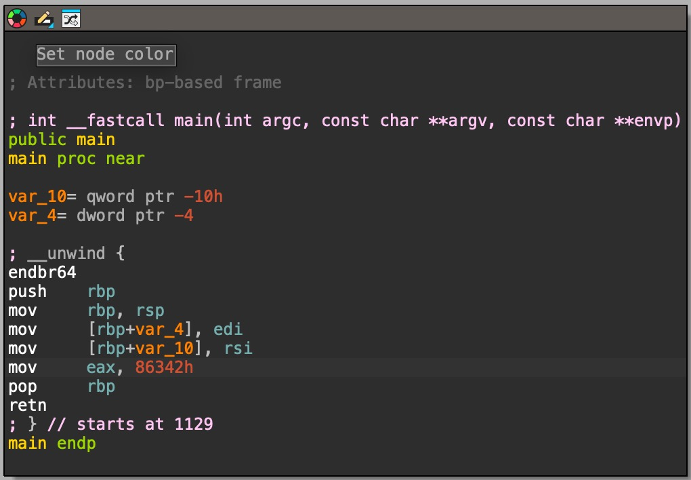
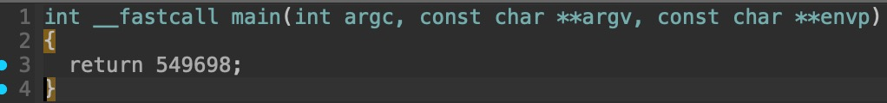

# 1. GDB baby step 1

Can you figure out what is in the eax register at the end of the main function? Put your answer in the picoCTF flag format: picoCTF{n} where n is the contents of the eax register in the decimal number base. If the answer was 0x11 your flag would be picoCTF{17}.

## Solution:

1.Used file command to determine file type and architecture 
```
file debugger0_a 
debugger0_a: ELF 64-bit LSB pie executable, x86-64, version 1 (SYSV), dynamically linked, interpreter /lib64/ld-linux-x86-64.so.2, BuildID[sha1]=15a10290db2cd2ec0c123cf80b88ed7d7f5cf9ff, for GNU/Linux 3.2.0, not stripped
```

Key findings:- file format:-ELF,architecture:-x86-64n,

2.I used to IDA's decompiler,(this is because the question asked to find contents of the eax register,which is responsible for storing return value of a function)


3.Found the contents,converted them from hexadecimal to decimal format.

## Flag:

```
picoCTF{549698}
```

## Concepts learnt:

-The x86-64 instruction set
- Assembly Instructions: mov (copies value from source to destination)
-use of "h" suffix for hexadecimal notation

## Notes:

- Initialy when i found the contents,I didn't know that the suffix -h was for hexadecimal,so I assumed that the contents given were part of the flag and tried to submit it without any conversion.
- Generating the psedocode of the main function in IDA,directly gave the answer in decimal format


## Resources:

-IDA Pro: The primary analysis tool used to view the assembly and pseudo-code.(https://hex-rays.com/)
-Guide to x86-64:list of registers used(https://web.stanford.edu/class/cs107/guide/x86-64.html)
-Hexadecimal Conversion:online tool used to convert the final hexadecimal value to the required decimal format.(https://www.rapidtables.com/convert/number/hex-to-decimal.html)


***

# 2. Challenge name

> Description

.
.
.
