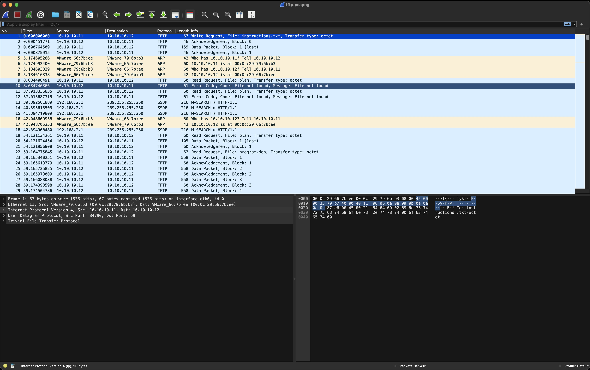
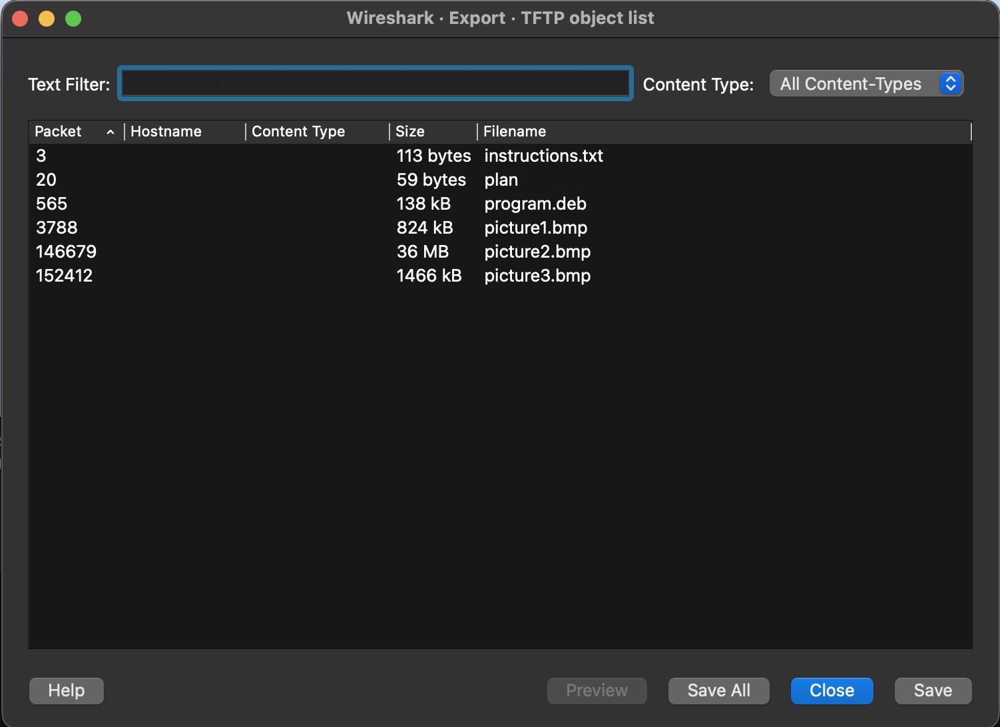
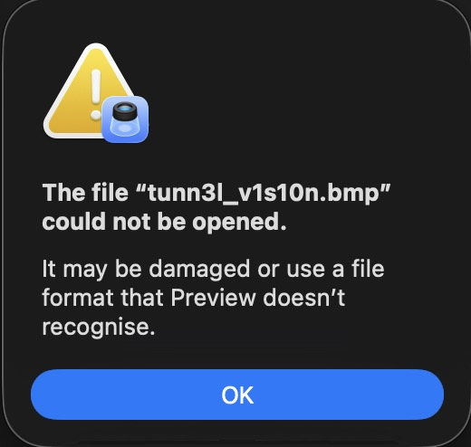
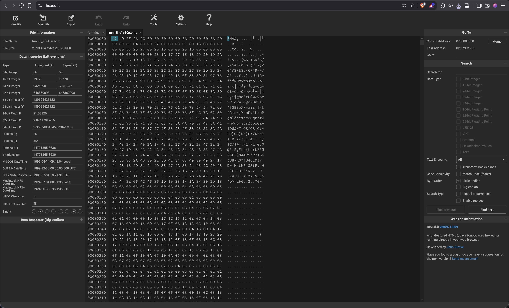
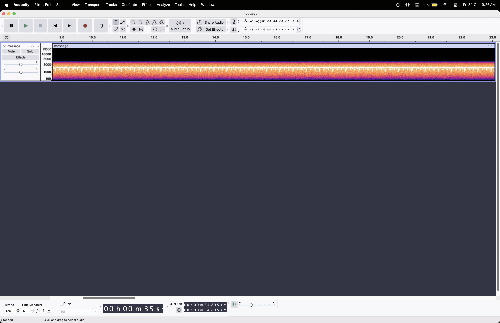
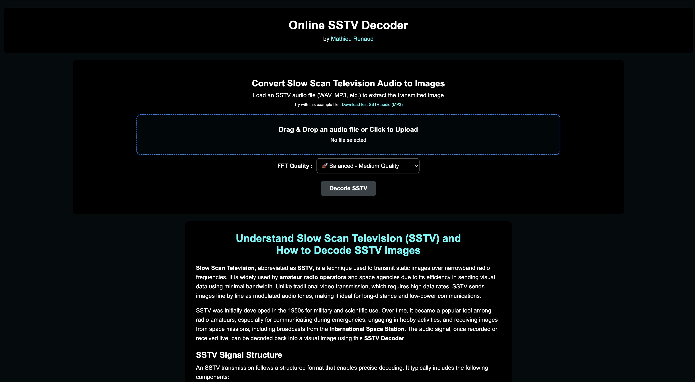
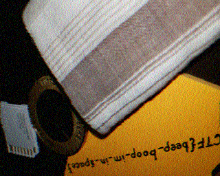

# 1. Trivial Flag Transfer Protocol

Figure out how they moved the flag.

## Solution:

1.Opened the file in wireshark.

<br>

2.Found out that TFTP protocol is used(looked it up and found that it is a protocol used to transfer files).Used export objects feature to automatically reconstruct transferred files.(Files-->Export Objects-->TFTP)

6 files were reconstructed(3 images,2 text files, 1 .deb file,)
<br>

3.Opened file instruction and found the following text with
```
GSGCQBRFAGRAPELCGBHEGENSSVPFBJRZHFGQVFTHVFRBHESYNTGENAFSRE.SVTHERBHGNJNLGBUVQRGURSYNTNAQVJVYYPURPXONPXSBEGURCYNA
```
Tried decoding(using cyberchef) using different common ciphers and encodings used,found out that ROT13 cipher was used and the original text was
```
TFTPDOESNTENCRYPTOURTRAFFICSOWEMUSTDISGUISEOURFLAGTRANSFER.FIGUREOUTAWAYTOHIDETHEFLAGANDIWILLCHECKBACKFORTHEPLAN
(TFTP DOESNT ENCRYPT OUR TRAFFIC SO WE MUST DISGUISE OUR FLAG TRANSFER.FIGURE OUT A WAY TO HIDE THE FLAG AND I WILL CHECK BACK FOR THE PLAN.)
```
The word "PLAN" leads me to believe that the next clue is in the plan file.Upon opening the file the following text is seen:
```
VHFRQGURCEBTENZNAQUVQVGJVGU-QHRQVYVTRAPR.PURPXBHGGURCUBGBF
```
Seeing how ROT13 cipher was used for the instruction,I assumed the same here and decoded using cyberchef which got me the following result
```
IUSEDTHEPROGRAMANDHIDITWITH-DUEDILIGENCE.CHECKOUTTHEPHOTOS
(I USED THE PROGRAM AND HID IT WITH-DUE DILIGENCE.CHECK OUT THE PHOTOS)
```
<br>

4.The "PROGRAM" is the .deb file,Upon further inspection the program is found to be 'steghide'.Now we need a password to extract the required data from the image.I assume the password is DUEDILIGENCE due to the emphasis put on it in the plan file.
I first run the command with image one.
```
steghide extract -sf picture1.bmp -p “DUEDILIGENCE”
```
However I get no output and am shown the message.
```
steghide: could not extract any data with that passphrase!
```
Then I run it for image 2.
```
steghide extract -sf picture2.bmp -p “DUEDILIGENCE”
```
Again no useful output.Finally I run it for image 3 and get a text file.
```
steghide extract -sf ./picture3.bmp -p “DUEDILIGENCE”
```
<br>

The file contains the flag
5.
## Flag:

```
 picoCTF{h1dd3n_1n_pLa1n_51GHT_18375919}
```

## Concepts learnt:

- Network Traffic Analysis: How to use Wireshark to open a packet capture (.pcap) and inspect the protocols being used.
- Protocol-Specific Extraction: How to identify a specific protocol like TFTP and use Wireshark's "Export Objects" feature to easily reconstruct all files transferred over it.
- Steganography: What steghide is and how to use its extract command.

## Notes:

- A mistake I made was to try the password as WITH-DUEDILIGENCE and -DUEDILIGENCE.The challenge was to just pull the keyword from the sentence.
- 

## Resources:

- Wireshark(https://www.wireshark.org/)
- Cyberchef(https://gchq.github.io/CyberChef/)
- Steghide(https://steghide.sourceforge.net/)


***

# 2. tunn3l v1s10n

We found this file. Recover the flag.

## Solution:

1.Used file command to determine file type
```
file tunn3l_v1s10n
tunn3l_v1s10n: data
```
This data was not really helpful so i decided to use exiftool on the file.
```
exiftool tunn3l_v1s10n
ExifTool Version Number         : 13.36
File Name                       : tunn3l_v1s10n
Directory                       : .
File Size                       : 2.9 MB
File Modification Date/Time     : 2025:10:30 14:54:28+05:30
File Access Date/Time           : 2025:10:30 14:54:28+05:30
File Inode Change Date/Time     : 2025:10:30 14:54:31+05:30
File Permissions                : -rw-r--r--
File Type                       : BMP
File Type Extension             : bmp
MIME Type                       : image/bmp
BMP Version                     : Unknown (53434)
Image Width                     : 1134
Image Height                    : 306
Planes                          : 1
Bit Depth                       : 24
Compression                     : None
Image Length                    : 2893400
Pixels Per Meter X              : 5669
Pixels Per Meter Y              : 5669
Num Colors                      : Use BitDepth
Num Important Colors            : All
Red Mask                        : 0x27171a23
Green Mask                      : 0x20291b1e
Blue Mask                       : 0x1e212a1d
Alpha Mask                      : 0x311a1d26
Color Space                     : Unknown (,5%()
Rendering Intent                : Unknown (826103054)
Image Size                      : 1134x306
Megapixels                      : 0.347
```
From this I dound that the files was an BMP file.I renamed the file with a .bmp extension at the end and tried opening the image but instead of seeing an iamge,I was being given an error.



<br>

2.I opened the file in hexedit to view the data in hex format.I also looked up bitmapinfoheaders example and compared the two.Imediately I notice a difference in the hexcodes in the BMP header,the offset where the pixel arrays can be found is different,however that should not be the case.



<br>
[screenshot of example of bmp file header](./Screenshots/Forensics_Challenge2_example.jpg)

The file
```
0xBA, 0xD0, 0x00, 0x00    #This is 53,434 bytes
```
```
0x36 0x00 0x00 0x00     # This is 54 bytes.
```
So I fix the problem and downlaod the image.However I again get the error message I got before,indicating that the problem has not been fixed

3.I then move to comparing the DIB header and imediately I notice a difference the hexcodes at the start of the DIB header does not look how it is supposed to.These bytes tell the size of the DIB header which is generally 40
The file
```
0xBA, 0xD0, 0x00, 0x00    #This is 53,434 bytes
```
How it should be
```
0x28 0x00 0x00 0x00    # This is 40 bytes
```
So I fixed the header and dowloaded the image.


This was a dummy or more of a decoy image with the text
```
notaflag{sorry}
```
<br>

3.Further moving on I change the value of the widht and height values in the DIB header,to make sure the entire image is being shown(I change them such that they form a 1920X1080 image).Changing both distorted the image,so i changed the height back to orignal,however I got a distorted iamge again.Finally I changed back the widht to the orignal and increased the height to 1080 pixels.The full image can now been seen and the flag is found


## Flag:

```
picoCTF{qu1t3_a_v13w_2020}
```

## Concepts learnt:

- Hex Editing: Gained experience using a hex editor (hexedit) to manually analyze and repair binary file data.
- File Format Analysis (BMP): Learned about the specific structure of a BMP file, including the main File Header (which contains the pixel array offset) and the DIB Header (which contains the header size and image dimensions).
- Data Corruption: Understood how a file can be "corrupted" by simply changing a few bytes in its header (like the DIB header size or image height).

## Notes:

- If i fixed the error in the DIB header before the BMP header,the decoy image came in a different colour.
## Resources:

- hexedit(https://hexed.it/)
- BMP file format(https://en.wikipedia.org/wiki/BMP_file_format)


***

# 3. m00nwalk

Decode this message from the moon.

## Solution:

1.opened the wav file in audacity to check if any hints are present in the spectrogram.However,I find nothing of use.

<br>

2.After listening to the audio, I noticed a distinct, repeating pulse.Upon research I find that this is characteristic of an SSTV transmission,so I try to use a SSTV decoder.

<br>

3.After using the decoder,an image is seen which contains the flag.<br>

<br>

## Flag:

```
picoCTF{beep_boop_im_in_space}
```

## Concepts learnt:

- UART Protocol Decoding: Learned how to identify a common digital communication protocol, Async Serial (UART), from its visual waveform.
- Using Protocol Analyzers: An understanding that the specific software, such as Logic 2, includes "analyzers" that could be run on raw signals to instantly decode into readable data formats like text or hex.

## Resources:

-   Online SSTV Decoder(https://sstv-decoder.mathieurenaud.fr/)
-   Slow-scan television(https://en.wikipedia.org/wiki/Slow-scan_television)
 
***