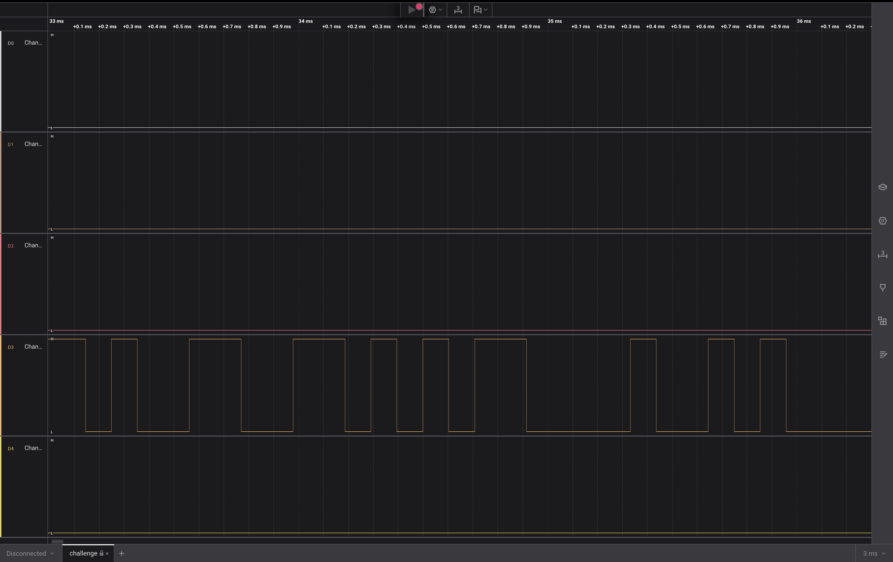
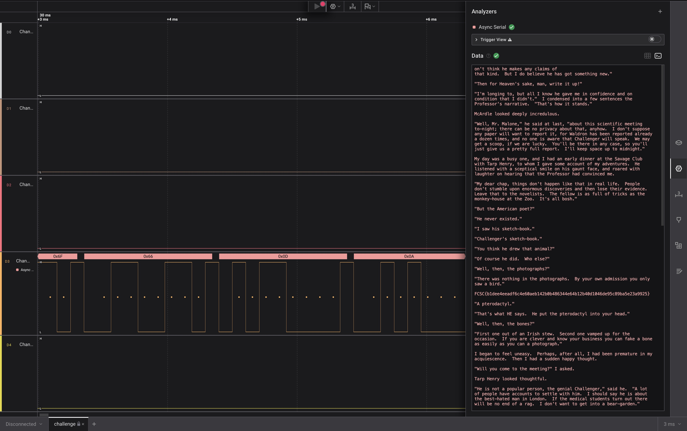

# 2. I like Logic

i like logic and i like files, apparently, they have something in common, what should my next step be.

## Solution:

1.Using file command
```
file challenge.sal
challenge.sal: Zip archive data, at least v2.0 to extract, compression method=deflate
```
This does not really help,so I use exiftool,however,that also did not help.

2.I look up .sal and find that it is a capture file from the Saleae Logic Operator.I installed Logic 2 to further analyze the file.
Upon opening the file in Logic 2,We find a signal.


3.To decode this signal into readable characters, I added an "Async Serial" analyzer to the signal channel.(left the default settings for the analyzer)

## Flag:

```
FCSC{b1dee4eeadf6c4e60aeb142b0b486344e64b12b40d1046de95c89ba5e23a9925}
```

## Concepts learnt:

- Hardware Signal Analysis: Gained experience with what a "logic analyzer".
- 


## Resources:

- Include the resources you've referred to with links. [example hyperlink](https://google.com)


***

# 3. Bare Metal Alchemist

> Put in the challenge's description here

## Solution:

- Include as many steps as you can with your thought process
- You **must** include images such as screenshots wherever relevant.

```
put codes & terminal outputs here using triple backticks

you may also use ```python for python codes for example
```

## Flag:

```
TFCCTF{Th1s_1s_som3_s1mpl3_4rdu1no_f1rmw4re}
```

## Concepts learnt:

- Include the new topics you've come across and explain them in brief
- 

## Notes:

- Include any alternate tangents you went on while solving the challenge, including mistakes & other solutions you found.
- 

## Resources:

- Include the resources you've referred to with links. [example hyperlink](https://google.com)


***