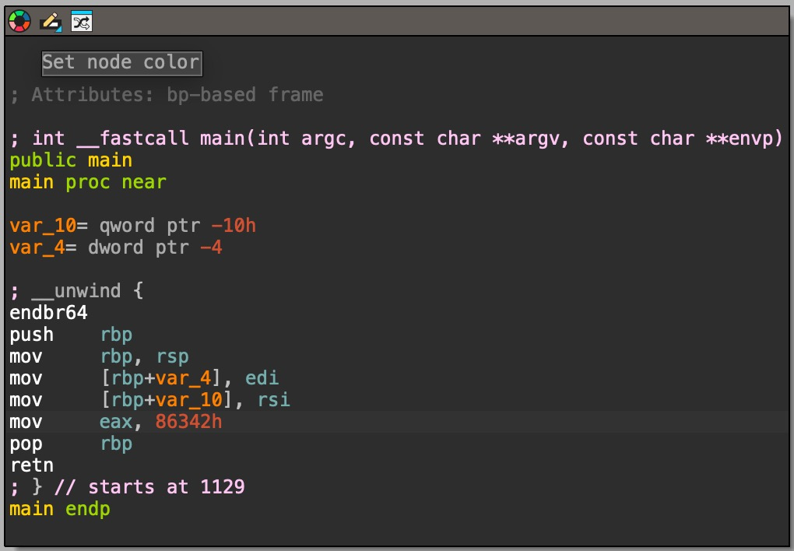
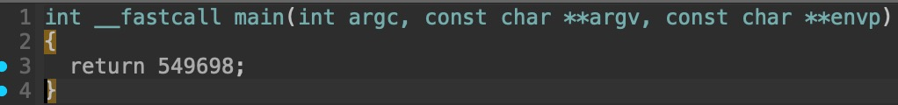

# 1. GDB baby step 1

Can you figure out what is in the eax register at the end of the main function? Put your answer in the picoCTF flag format: picoCTF{n} where n is the contents of the eax register in the decimal number base. If the answer was 0x11 your flag would be picoCTF{17}.

## Solution:

1.Used file command to determine file type and architecture 
```
file debugger0_a 
debugger0_a: ELF 64-bit LSB pie executable, x86-64, version 1 (SYSV), dynamically linked, interpreter /lib64/ld-linux-x86-64.so.2, BuildID[sha1]=15a10290db2cd2ec0c123cf80b88ed7d7f5cf9ff, for GNU/Linux 3.2.0, not stripped
```

2.I used IDA's decompiler,(this is because the question asked to find contents of the eax register,which is responsible for storing return value of a function)


3.Found the contents,converted them from hexadecimal to decimal format.

## Flag:

```
picoCTF{549698}
```

## Concepts learnt:

-  The x86-64 instruction set
-  Assembly Instructions
-  use of "h" suffix for hexadecimal notation

## Notes:

- Initially when i found the contents,I didn't know that the suffix -h was for hexadecimal,so I assumed that the contents given were part of the flag and tried to submit it without any conversion.
- Generating the psedocode of the main function in IDA,directly gave the answer in decimal format


## Resources:

-  IDA Pro: The primary analysis tool used to view the assembly and pseudo-code.(https://hex-rays.com/)
-  Assembly basics:(https://www.youtube.com/watch?v=LdWU8JEfPhg&t=25s)
-  Guide to x86-64:(https://web.stanford.edu/class/cs107/guide/x86-64.html)
-  Hexadecimal Conversion:online tool used to convert the final hexadecimal value to the required decimal format.(https://www.rapidtables.com/convert/number/hex-to-decimal.html)


***


# 2.ARMssembly 1

For what argument does this program print `win` with variables 58, 2 and 3? File: chall_1.S Flag format: picoCTF{XXXXXXXX} -> (hex, lowercase, no 0x, and 32 bits. ex. 5614267 would be picoCTF{0055aabb})


## Solution:

1.Used file command to determine file type.
```
file chall_1.S
chall_1.S: assembler source text, ASCII text

```
2.Analysis of main function:Upon analyzing the main function,we find that function func is called and the result is returned in w0.Subsequently contents of w0 is compared to 0,if w0 is not equal to 0 the flow is branched to .L4 which eventually results in the You Lose :( output.
```
main:
	stp	x29, x30, [sp, -48]!
	add	x29, sp, 0
	str	w0, [x29, 28]
	str	x1, [x29, 16]
	ldr	x0, [x29, 16]
	add	x0, x0, 8
	ldr	x0, [x0]
	bl	atoi
	str	w0, [x29, 44]
	ldr	w0, [x29, 44]
	bl	func
	cmp	w0, 0
	bne	.L4
	adrp	x0, .LC0
	add	x0, x0, :lo12:.LC0
	bl	puts
	b	.L6

```

3.Analysis of func:I traced the flow in func to determine the value required to make the value returned to w0 in main is 0.
Here three hardcoded constants are present.

```
    func:
	sub	sp, sp, #32
	str	w0, [sp, 12]        #The user input is stored at memory loaction [sp,12]
	mov	w0, 58
	str	w0, [sp, 16]        # 58 (stored at memory location[sp,16])
	mov	w0, 2
	str	w0, [sp, 20]        # 2 (stored at memory location[sp,20])
	mov	w0, 3
	str	w0, [sp, 24]        # 3 (stored at memory location[sp,24])
	ldr	w0, [sp, 20]
	ldr	w1, [sp, 16]
	lsl	w0, w1, w0.         # 58 is being shifted to the left by 2 bits
	str	w0, [sp, 28]        # result of shift=232 stored at [sp,28]
	ldr	w1, [sp, 28]        # 232 is loaded into w1
	ldr	w0, [sp, 24]        # 3 is loaded into w0
	sdiv	w0, w1, w0      # w0=w0/w1
	str	w0, [sp, 28]        # result=77 of sdiv stored at [sp,28]
	ldr	w1, [sp, 28]        # 77 loaded into w1
	ldr	w0, [sp, 12]        # user input loaded in w0
	sub	w0, w1, w0          # w0=w1-w0  (final result=user input -77)
	str	w0, [sp, 28]        # result stored at [sp,28]
	ldr	w0, [sp, 28]        
	add	sp, sp, 32
	ret
	.size	func, .-func
	.section	.rodata
	.align	3
```

From the analysis it is clear that 77-user input needs to be 0 so that the function returns 0.Thus the user input needs to be 77

4.Flag formating:77 is then converted to hexadecimal,which is 4D and changed to fit the requriements provided by the challenge
## Flag:

```
picoCTF{0000004d}
```

## Concepts learnt:
-   ARMv8-A(AArch64,this is the 64 bit set) instruction set
-   In ARM w0 register is used to hold return value of function
-   ARM instruction set:-logical shift left(lsl),signed divided(sdiv),comparison(cmp),Branch if Not Equal(bne)

## Notes:
-   only static analysis was used to solve the challenge as the target value was calculated using hardcoded constants,makign dynamic debuggin(GDB) unecessary

## Resources:
-   dec to hex converter (https://www.rapidtables.com/convert/number/decimal-to-hex.html)
-   ARM Instruction Set (https://iitd-plos.github.io/col718/ref/arm-instructionset.pdf)

***

# 3. vault-door-3

This vault uses for-loops and byte arrays. The source code for this vault is here: VaultDoor3.java
## Solution:

1.Analysing the code:The challenge provides a file with the following code in Java

```
import java.util.*;

class VaultDoor3 {
    public static void main(String args[]) {
        VaultDoor3 vaultDoor = new VaultDoor3();
        Scanner scanner = new Scanner(System.in);
        System.out.print("Enter vault password: ");
        String userInput = scanner.next();
	String input = userInput.substring("picoCTF{".length(),userInput.length()-1);
	if (vaultDoor.checkPassword(input)) {
	    System.out.println("Access granted.");
	} else {
	    System.out.println("Access denied!");
        }
    }

    // Our security monitoring team has noticed some intrusions on some of the
    // less secure doors. Dr. Evil has asked me specifically to build a stronger
    // vault door to protect his Doomsday plans. I just *know* this door will
    // keep all of those nosy agents out of our business. Mwa ha!
    //
    // -Minion #2671
    public boolean checkPassword(String password) {
        if (password.length() != 32) {
            return false;
        }
        char[] buffer = new char[32];
        int i;
        for (i=0; i<8; i++) {
            buffer[i] = password.charAt(i);
        }
        for (; i<16; i++) {
            buffer[i] = password.charAt(23-i);
        }
        for (; i<32; i+=2) {
            buffer[i] = password.charAt(46-i);
        }
        for (i=31; i>=17; i-=2) {
            buffer[i] = password.charAt(i);
        }
        String s = new String(buffer);
        return s.equals("jU5t_a_sna_3lpm12g94c_u_4_m7ra41");
    }
}

```
we can see that the function checkPasswords takes the input string,manipulates it and compares it against with jU5t_a_sna_3lpm12g94c_u_4_m7ra41.If the strings match the password is correct.

2.Breaking down checkPassword and reversing the process to get oringal password:for getting the orignal password we just reverse the logic of each loop.Writing a python code to do so.

```
buffer="jU5t_a_sna_3lpm12g94c_u_4_m7ra41"
target = [""] * 32

for i in range(8):
    target[i] =buffer[i]

for i in range(8, 16):
    target[23-i] = buffer[i]
    
for i in range(16, 32, 2):
    target[46-i] = buffer[i]
    
for i in range(31, 16, -2):
    target[i] = buffer[i]

final=''
for i in target:
    final+=i
    
print(final)
```
Output:
```
jU5t_a_s1mpl3_an4gr4m_4_u_c79a21
```

## Flag:

```
picoCTF{jU5t_a_s1mpl3_an4gr4m_4_u_c79a21}
```

## Concepts learnt:

- Java syntax and functions

## Notes:

- initially i started by recountructing the password one charecter at a time,but seeing as that was time consuming,i decided to just write the code in python
- this challene was easier compared to the other two in this assigment,due to prior knowledge and decent hold on the concept of loops and indexing

## Resources:

- online python compiler(https://www.programiz.com/python-programming/online-compiler/)


***
