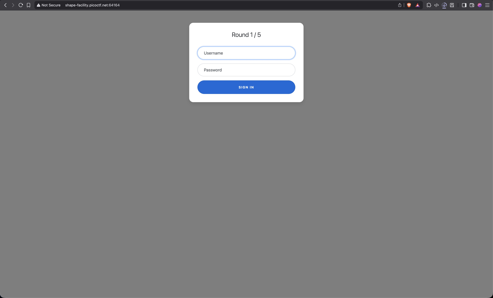
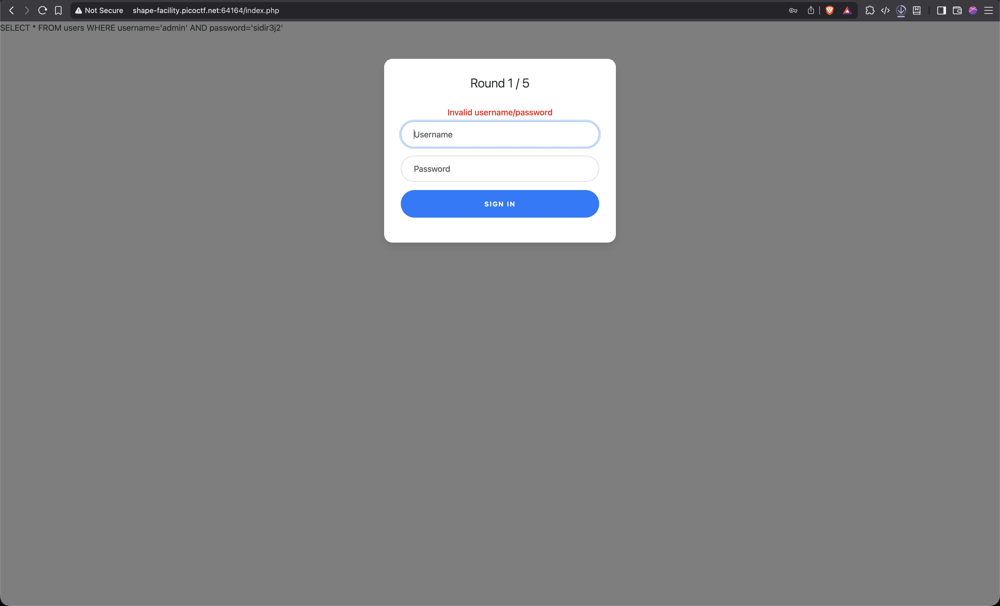
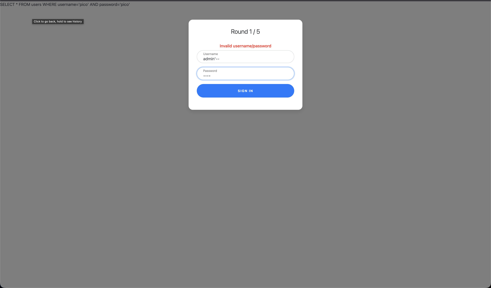
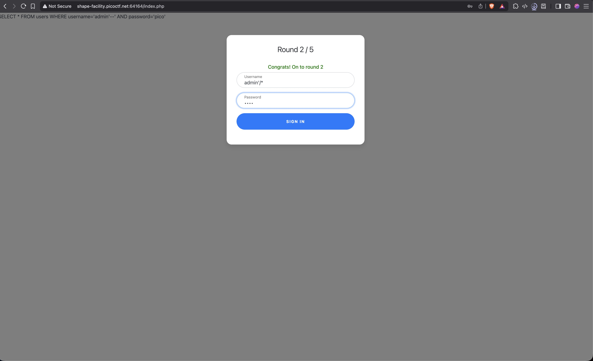
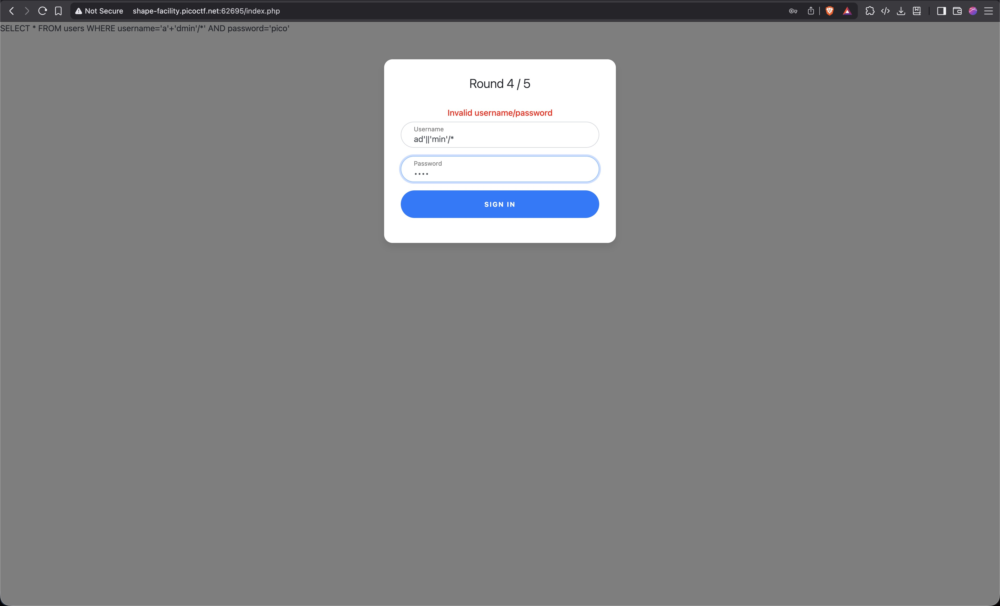
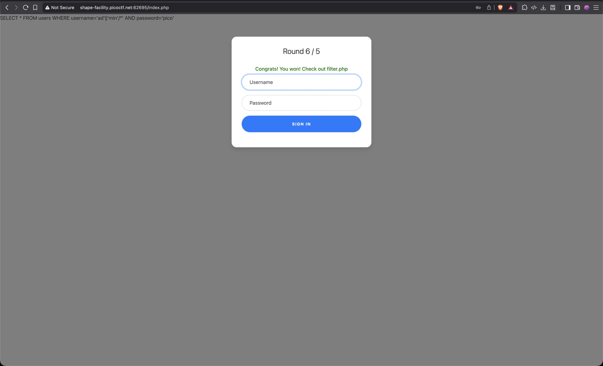
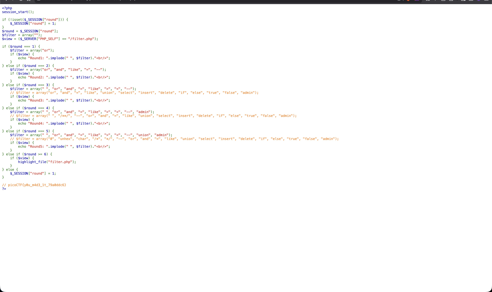

# 1. Web Gauntlet 

Can you beat the filters?
Log in as admin http://shape-facility.picoctf.net:64164/ http://shape-facility.picoctf.net:64164/filter.php

## Solution:

1.We are given two links,upon opening the links we can see a login page and a page with some text   

and text on the second page is 

```
Round1: or
```
<br>
2.I start by inputing a random username and password to see what kind of error is shown.However along with an error,the page also shows an sql command.This make me believe that this challenge is based on sql injection.


Now we need to give the username such that it breaks the sql command and prevents the page from fethcing any password.I first try using 'or' however that does not take me anywhere,this make me conclude that the text on page 2 tells us what is restricted.For the second try i use '--',this is used to make comments in sql.Using that I am hoping that the page is unable to fetch the password from the database.So to test my theory I enter "admin'--" in the admin field and enter a random password.


This is accepted by the page and I move on to the next round.The final sql query would look like
```
SELECT * FROM users WHERE username='admin' --' AND password='pico'
```
<br>
3.Now on after reaching round 2,I check page 2 and see that new restrictions have been applied.
```
Round2: or and like = --
```
However '--' is not the only way sql supports comment, we can use '/* */' to write multiline comments.


This works and we move to round 3.The final sql query would look like
```
SELECT * FROM users WHERE username='admin' /*' AND password='pass'
```
<br>
4.Again checking page 2, I find new restrictions.

```
Round3: or and = like > < --
```

Seeing how our multiline comment injection is still not restricted I just use that again and we move to the next round.
<br>

5.Checking page 2,I find more new restrictions.

```
Round4: or and = like > < -- admin
```

Now the word admin has been banned,i need to find a way to input admin.First I think of using the concat() function,however upon thinking a bit it does not seem feasable as the input I give is between quotes and due to that it will be taken like a string.Then I try to use '+' operator to add two strings to make the word admin,however that fails.Upon further reasearch i find a concat operator '||' and try using that.


This is succesful and I move on to the next round.The sql query would look like
```
SELECT * FROM users WHERE username='ad'||'min'/*' AND password='pass'
```
<br>
6.Round 5 the final round upon logining in on this page,we should get the flag.Like always i check page 2 for restrictions
```
Round5: or and = like > < -- union admin
```
Seeing how our concat operator and multiline comment trick are still not restricted,I just try using that again.
It works and I am shown a message.


Going to page 2,I can see the final flag!


The sql query would be:
```
ad'||'min'/*
```

## Flag:
```
picoCTF{y0u_m4d3_1t_79a0ddc6}
```

## Concepts learnt:

- Include the new topics you've come across and explain them in brief
- 

## Notes:

- Include any alternate tangents you went on while solving the challenge, including mistakes & other solutions you found.
- 

## Resources:

- Include the resources you've referred to with links. [example hyperlink](https://google.com)


***

# 2. SSTI1 

> Put in the challenge's description here

## Solution:

- Include as many steps as you can with your thought process        
- You **must** include images such as screenshots wherever relevant.

```
put codes & terminal outputs here using triple backticks

you may also use ```python for python codes for example
```

## Flag:

```
picoCTF{}
```

## Concepts learnt:

- Include the new topics you've come across and explain them in brief
- 

## Notes:

- Include any alternate tangents you went on while solving the challenge, including mistakes & other solutions you found.
- 

## Resources:

- Include the resources you've referred to with links. [example hyperlink](https://google.com)


***

# 3. Cookies

> Put in the challenge's description here

## Solution:

- Include as many steps as you can with your thought process
- You **must** include images such as screenshots wherever relevant.

```
put codes & terminal outputs here using triple backticks

you may also use ```python for python codes for example
```

## Flag:

```
picoCTF{}
```

## Concepts learnt:

- Include the new topics you've come across and explain them in brief
- 

## Notes:

- Include any alternate tangents you went on while solving the challenge, including mistakes & other solutions you found.
- 

## Resources:

- Include the resources you've referred to with links. [example hyperlink](https://google.com)


***